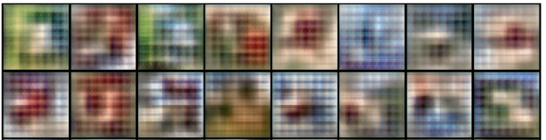
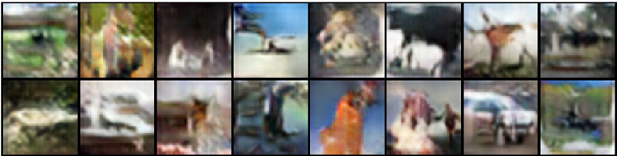
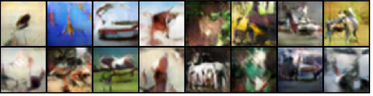

# Image Generator

A Generative Adversarial Model (GAN) trained on CIFAR-10 dataset across different learning rates.

### Learning Rate = 0.001

### Learning Rate = 0.0005

### Learning Rate = 0.0002

